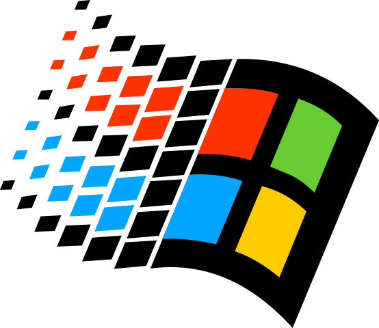

<p align="center"></p>

# `winapi-tlb-bindgen`

> Generates bindings to COM interfaces, enums and coclasses.

## Usage

See the `test-msxml` and `test-wmi` subdirectories for full examples of using
this library to generate bindings for the MSXML library and the WMI library
respectively.

1. Find the typelib for the COM library you want to generate bindings for:

   - If you have a `.tlb` file, use that.
   - If you have a `.dll` with an embedded `.tlb` resource, use that.
   - If you have a `.idl`, generate a `.tlb` with `midl.exe` from the Windows
     SDK via `midl.exe .\foo.idl /tlb .\foo.tlb` and use that.

   To be sure that a `.tlb` / `.dll` will work with `winapi-tlb-bindgen`, you
   can create a C++ project in MSVC and try to [`#import` the `.tlb` /
   `.dll`.](https://docs.microsoft.com/en-us/cpp/preprocessor/hash-import-directive-cpp)
   If that compiles, then it should work with `winapi-tlb-bindgen`

1. Add your dependencies. You can either use the utilities of the crate
   [`cargo-edit`](https://crates.io/crates/cargo-edit) to do that:

   ```sh
   # add winapi-tlb-bindgen to build deps from github
   cargo add winapi-tlb-bindgen --git https://github.com/cdbrkfxrpt/winapi-tlb-bindgen.git --build
   # add winapi to deps with the correct features
   cargo add winapi@0.3.9 --features "objbase oleauto winerror"
   # OPTIONAL: add anyhow for easier error handling
   cargo add anyhow@1 --build
   cargo add anyhow@1
   ```

   The features for the `winapi` create give you access to things like
   `HRESULT`, `IUnknown` and other COM types. You may want to enable other
   features for the things you need.

   Alternatively, you can add the dependencies manually to your `Cargo.toml`,
   which should then look at least like this:

   ```toml
   [dependencies]
   anyhow = "1"
   winapi = { version = "0.3.9", features = ["objbase", "oleauto", "winerror"] }


   [build-dependencies]
   anyhow = "1"
   winapi-tlb-bindgen = { git = "https://gitlab.bmc-labs.com/libraries/winapi-tlb-bindgen.git" }
   ```

1. Add a build script `build.rs` in the project root, right next to the
   `Cargo.toml` file. The build script has to use this crate to generate the
   bindgen output for the COM library, like so:

   ```rust
   use anyhow::Result; // optional; used to let main return `Result`
   use std::{env, fs, path::Path};

   fn main() -> Result<()> {
     // the TLB file is the input; it contains the library spec
     let tlb_filepath = Path::new("path/to/tlb_file").join("my_lib.tlb");

     // the bindings path is where we are going to write our lib bindings
     let bindings_path = Path::new(&env::var("OUT_DIR")?).join("my_lib.rs");

     // let's generate some bindings
     winapi_tlb_bindgen::build(&tlb_filepath,
                               false,
                               fs::File::create(bindings_path)?)?;

     // if we made it here, things went swell
     Ok(())
   }
   ```

1. Generate the bindgen output in your main code. You can do this simply above
   your main or at the beginning of your `lib.rs`, but adding a module for this
   purpose is probably more convenient:

   ```rust
   // src/my_lib.rs

   // silence warnings for identifier names and unused functions
   #![allow(non_camel_case_types, non_snake_case, unused)]

   use winapi::{shared::{guiddef::GUID,
                         minwindef::{INT, UINT},
                         winerror::HRESULT,
                         wtypes::{BSTR, DATE, VARIANT_BOOL}},
                um::{oaidl::{IDispatch, IDispatchVtbl, LPDISPATCH, VARIANT},
                     unknwnbase::{IUnknown, IUnknownVtbl, LPUNKNOWN}},
                ENUM,
                RIDL,
                STRUCT};

   include!(concat!(env!("OUT_DIR"), "/my_lib.rs"));
   ```

   You may need to adapt the `winapi` imports to your use case. Compiler
   warnings will give you guidance.

   ```rust
   // src/main.rs or src/lib.rs
   mod my_lib;
   ```

1. Build your crate.

1. Compare the output against [the C++ headers generated by MSVC with
   `#import`.](https://docs.microsoft.com/en-us/cpp/preprocessor/hash-import-directive-cpp#_predir_the_23import_directive_header_files_created_by_import)
   File a bug if something was emitted incorrectly.

1. Enjoy your COM API bindings.

   ```rust
   // src/main.rs

   mod msxml;

   fn main() {
   	unsafe {
   		let hr = winapi::um::objbase::CoInitialize(std::ptr::null_mut());
   		assert!(winapi::shared::winerror::SUCCEEDED(hr));

   		let mut document: *mut winapi::ctypes::c_void = std::ptr::null_mut();
   		let hr =
   			winapi::um::combaseapi::CoCreateInstance(
   				&<msxml::DOMDocument as winapi::Class>::uuidof(),
   				std::ptr::null_mut(),
   				winapi::um::combaseapi::CLSCTX_ALL,
   				&<msxml::IXMLDOMDocument as winapi::Interface>::uuidof(),
   				&mut document,
   			);
   		assert!(winapi::shared::winerror::SUCCEEDED(hr));
   		let document = &*(document as *mut msxml::IXMLDOMDocument);

   		// ...

   		document.Release();
   	}
   }
   ```

## `winapi-tlb-bindgen-bin`

The `winapi-tlb-bindgen-bin` crate is a binary that takes in the path of the
typelib as a command-line parameter, and writes the bindgen output to stdout.
This can be used to generate bindings manually for greater control, as opposed
to using a build script to automatically generate the bindings on every build.
You would also do this if you wanted your crate to be able to be built on
non-Windows platforms.

```powershell
cd winapi-tlb-bindgen-bin
cargo run -- 'C:\Program Files (x86)\Windows Kits\10\Lib\10.0.16299.0\um\x64\MsXml.Tlb'
```
